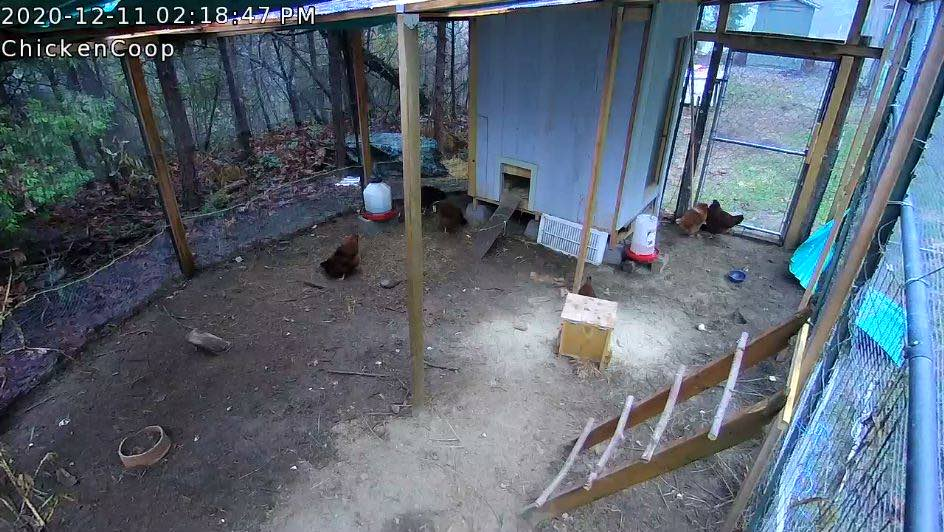

# Chicken Coop automation using the Arduino platform

> Authors Note: Even though the focus of this project is to automate a chicken coop door,  the same system could be applied to many other automation tasks such as a remote weather station or irrigation system control.

When the Covid hit we saw all sorts of supply chain instability.  Our way of addressing this problem was to install a device that converts food scraps into eggs, aka chickens.  We happened to be blessed to reside in area that has an abundant supply of predators (of the four legged variety), and would be prudent to setup a safe-space, for the egg production machines,  I believe the  technical term is "chicken coop". 

We setup the coop is a remote part of our property, and quickly discovered the need to automate the coop door,  especially in the winter.   Lock it up at night and open first thing in the morning.   I researched  a number of coop door systems; some were as simple as time clocks and relays, others were fairly complicated.   As an engineer (and a long in the tooth hardware hacker), this  looked like a great really opportunity to create a cool home automation project.

  

I made up a list of requirements and nice-to-haves.

- Open and close coop door on sunrise/sunset 
- Optional remote-control of coop-door
- Daylight simulation to encourage egg production in winter
- Monitor coop temperature for possible heater or vent control
- Be somewhat resilient to power failures.

### First Pass

Initially this seemed like a fairly easy Arduino project.  Looking around I came across lots of cool stuff online and constructed first prototype the Arduino Uno.   It didn't take long though for me to discover I was going to need a little more  flash memory that the 32K in the base ATMega328.    That is if I intended to code everything using C++ and the IDE.

Let's see why. First off,  We are going to need some  form of reliable real time clock and some math libriaies to derive sunrise and sunset.   Since the  power from the utilities is  always reliable around here,  I also need to build in  some form of UPS/battery and do the right thing when it powers back up.  Like reset the clock automatically.    Most devices do this with by  connecting to the Internet and pinging the [Network Time Protocol](http://www.ntp.org/ntpfaq/NTP-s-def.htm) (NTP) servers.   

I happen to have Internet available near my chicken coop.  Earlier on I had installed a IP few cameras in the yard, (remember the predators I mentioned)  affording me a  nearby Cat-5 drop in addition to abundant WIFI.   

I decided to try hooking up an Ethernet adapter first. There are a few Arduino Ethernet add-on boards available and adequate code libraries.  But in the end I wasn't happy with the power consumption of the Ethernet devices.  I might have to run on backup batteries for a few days during a power failure. To my surprise though, I discovered that the  [power consumption](https://diyi0t.com/how-to-reduce-the-esp8266-power-consumption/) of WIFI was actually lower than Ethernet when  using a ESP8266 module.

### Sparkfun Artemis 

After a few attempts at building the available libraries using the Arduino IDE I quickly hit the 32K flash  memory limit.  Sparkfun however had just introduced a Arduino compatible board with a similar footprint;  the [Artemis RedBoard](https://www.sparkfun.com/products/15444).   At about $20, this thing was really cool.  Based on the Cortex M4 Apollo3 chipset, the Artemis sported  1MB of flash and 384k of RAM.   But wait!  There's more, much more, including a  second hardware serial port,  built in realtime clock and a watchdog timer.  On top of all that it runs as a 3.3v device and eats less 1 mA!   Ok this is going to be fun.

Given that I now have room to write some code,  I decided to use one of the ESP8266 Wifi modules. You can pick them up for a few bucks all over the net.  Although I highly recommend that you get one configured with the latest firmware you can find.  Sparkfun happens to have an [ESP8266 (4MB Flash)](https://www.sparkfun.com/products/17146) already setup.

The ESP8266 is hooked up to the hardware **Serial1** port on the Artemis running at 115200 baud.  It effectively functions as a Wifi Modem using the [AT command set](https://www.espressif.com/sites/default/files/documentation/4a-esp8266_at_instruction_set_en.pdf).    The ESP8266  is fairly popular and I did find a few libraries, but I wasn't totally happy with them and ended up writing some C++ code to simplify network communications.   (See  [ESP8266Mgr and WifiParser.](https://github.com/vinthewrench/Coop2))


### Qwiic Connect

One of the other reasons I chose the Artemis RedBoard is that it supported the [Qwiic Connect System](https://www.smart-prototyping.com/Qwiic.html) is a nice packaging of the I2C protocol.  This makes it easy to get the rest of the hardware up and running quickly and there is a ton of devices [available](https://www.sparkfun.com/qwiic).

For this project I chose to  integrate a [Temperature Sensor](https://www.sparkfun.com/products/16304),  a pair of red and green [LED indicator buttons](https://www.sparkfun.com/products/16842) a [quad relay card](https://www.sparkfun.com/products/16566).  Here is a photo of the original layout. 


What you see on top of the Artemis  is the daughter board that I use to  mount the ESP8266.  I used a [Sparkfun Qwiic Shield](https://www.sparkfun.com/products/14352) which I modifying by removing the  [logic level converters](https://cdn.sparkfun.com/assets/5/1/a/3/b/Qwiic_Shield_for_Arduino_v10.pdf) (the Artemis was already running at 3.3 v).   In all honesty I could simply daisy chain the I2C Qwiic devices,  but I was debugging at the time and wanted to wire the bus in parallel. You don't need to do it this way.

### The buttons

I really liked the [Sparkfun Qwiic LED indicator buttons](https://learn.sparkfun.com/tutorials/sparkfun-qwiic-button-hookup-guide/all), They gave you solid tactile feedback and you can [control the LED brightness and duty cycle.](https://github.com/sparkfun/SparkFun_Qwiic_Button_Arduino_Library)  This was perfect for manual control of the coop door.  I used green for open and red for close and blink the LED while the door was in motion.  

 

Later I wrote an IOS app to talk to the controller and was able to use the same presentation.

 

### Put it in a box

I added a [Qwiic 20x4 LCD](https://www.sparkfun.com/products/16398) to help with debugging (it looked cool)  and  found a nifty battery that could act like a [UPS Backup](https://www.amazon.com/gp/product/B07W8MCBMS/).  I was able to mount all these cool goodies on a perf-board with some hot glue and screws and then fabricated a plexiglass cover to mount the buttons.

When I was done I  put the entire project in a standard [Irrigation Timer Box](https://www.homedepot.com/p/Orbit-Outdoor-Timer-Box-57095/100158884) and  mounted to the outside of the coop.  These boxes are pretty common, not to expensive and fairly weather resistant.   You can remove the GFI receptacle and back plate if you want and even plug up the entry holes with a PVC plug using PVC pipe cement.


### Door hardware

I constructed a simple sliding door using a piece of oriented strand board (OSB) and a set of [side mount drawer slides](https://www.homedepot.com/p/Everbilt-14-in-Full-Extension-Side-Mount-Ball-Bearing-Drawer-Slide-Set-D80614E-ZP-W/302867645).   Chickens are not the smartest of creatures and a few times I found them loitering under the door while it was in motion.  I really didn't want go through the trouble of building logic to detect chickens and prevent the chicken-chopper effect.  After a bit of experimentation I found a simple solution to the problem by employing  a cable to  hang the door from a linear actuator.  I let gravity do the work.  The door was not heavy enough to crush the chickens but once closed it was fairly difficult for a predator to slide up.   If you needed a higher security solution, you could add a solenoid driven bolt on the lower part of the rail.


### The door actuator 

Electric linear actuators are basically DC motors that convert rotary motion to linear motion using a lead-screw assembly.  [Here is a great description of how these things work](https://www.firgelliauto.com/blogs/news/inside-a-linear-actuator-how-a-linear-actuator-works).   I chose the Progressive Automations [PA-14 Mini Linear Electric Actuator]( https://www.amazon.com/gp/product/B00FAUMRH4/).  It has a weather protection rating of  IP54 which means it can get dirty and wet and still function well.  It does use about 5 amps of current while opening and closing the door,  but typically we only run for about 10 seconds twice a day. So even when running under battery power, that gives us a few days of action.

The PA-14 incorporates a built in set of limit switches.  All we needed to do to operate it,  is to run DC current though it one way to open and then reverse the polarity to close.    A simple way to accomplish this is by using a pair of SPDT relays in an  [H-bridge](https://mechatrofice.com/circuits/relay-dc-motor-driver) configuration as illustrated in the diagram below. The actuator motor will spin one direction or the opposite depending on which relay is activated.  This translates into up or down in our application.  


If you wanted to save a bit more power, you could use a set of MOSFETs,  and even save a few bucks on the relay board by connecting it directly to the Arduino digital I/O pins.   One of my favorites is the NXP MC33883.  Here is a [example circuit](https://www.instructables.com/DIY-High-Current-Motor-Driver-h-bridge/). Just remember that the Artemis is a 3.3v device.

### Power Management.

Earlier I mentioned that one of my design goals was to function a well I could during utility power failures.  One approach to this is to power the entire system with a solar array and battery charger.  Unfortunately the coop wasn't in the best place for solar charging during the winter months.  So I decide to rely on some form of UPS.   I found an easy solution in this [Shanqui UPS Battery Backup](https://www.amazon.com/gp/product/B07W8MCBMS/)  system.   The device  as shipped,  consists of a bunch of standard 18650  Li-on cells rated at 2200 ma.  This worked pretty well for me, though it wouldn't take much to replace the cells with something better down the road.

One of the reasons I really liked the Artemis is that it can run as low as 6μA/MHz and the Sparkfun Redboard has a [jumper that you can attach a current monitor](https://learn.sparkfun.com/tutorials/hookup-guide-for-the-sparkfun-redboard-artemis) to track both the Artemis and any of the devices power over Qwiic.    This gives us the ability to try various power management strategies and see what really happens.      

To start with, I removed the red power LEDs from the various Qwiic devices,  once everything is working there is no need for them. 

Another thing we can do is to determine if we are running on AC power or battery backup.    Something like a [INA219](https://www.adafruit.com/product/904) could monitor the power charge current coming into the battery,  or just check too see if there is voltage there with a simple opto-coupler like a [EL817](https://www.everlight.com/file/ProductFile/201407061833256242.pdf).    There are lots of things we can do to  change the behavior of our system when running on battery power alone.  For example, we can assume if there is no AC power that our network is probably also not available,  so we could shut down the Wifi. We could sleep the system and poll our devices a less often.

In addition we can also be a bit judicious about powering  down some of the peripherals when they are not being used.   For example,  relays for the actuator only need to be activated when the motor is running. Even though the actuator has built in limit switch and wont use current when it hits the limit, the drive circuit does.     At first I thought about hooking up a r[eed switch](https://www.digikey.com/en/products/detail/littelfuse-inc/59150-010/154470?s=N4IgTCBcDaIKwE4CMcAMBaVTUgLoF8g) and magnet to detect the door position, but that seems like overkill.  So I drive the open or close H-bridge relay for only the time it takes move the door ( about 10 seconds),  and then shut it off.   Maybe just keep one to detect the door close position, in case something jams the door.

Another use for the [reed switches](https://www.digikey.com/en/products/detail/littelfuse-inc/59150-010/154470?s=N4IgTCBcDaIKwE4CMcAMBaVTUgLoF8g) in on the enclosure door. If you look carefully at the photo of the enclosure above, you will see I glued a reed sensor to the lower right corner and a corresponding magnet on the door.  And hooked up once side to ground and the other to one of the pin 6 of the Artemis digital I/O lines.  Then you need to do is specify that it requires an input pull-up.

```c++
constexpr uint8_t pin_enclosureDoor = 6; 	// pin 6

pinMode(enclosureClosedPin, INPUT);
pinMode(enclosureClosedPin, INPUT_PULLUP);

if(enclosureClosedPin) ...
```

We can tell if the enclosure door is open by testing the state of  `enclosureClosedPin`  and for example shut down the Qwiic buttons as well as the backlight to the LCD display to save some power.  

### The code and development environment

I posted the source code for the project on GitHub at https://github.com/vinthewrench/Coop2. It can be built using the standard Arduino IDE by clicking on the `Coop2.ino` sketch file.  You need to do a little bit of setup of the board manager, but that is pretty easy and [documented](https://learn.sparkfun.com/tutorials/artemis-development-with-arduino) by the folks at Sparkfun.

I also created an Xcode project, because I liked that IDE editor, with a experimental makefile. My intent was to use the Arduino CLI or maybe  platformIO ([here is an experimental package for the Artemis](https://github.com/nigelb/platform-apollo3blue)), but I haven't really had any success yet.  [Sparkfun had to do a lot hacking](https://github.com/sparkfun/Arduino_Apollo3) to get the Apollo3 SDK to work under the Arduino framework and at the tine of this writing the version 2 SDK wasn't quite there yet.

So for now I suggest you use the  setup the board manager as Sparkfun [describes](https://learn.sparkfun.com/tutorials/artemis-development-with-arduino)  and use the Arduino IDE to compile and boatload the device. You can use any editor you want by checking the *"use external editor"* preference in the IDE.

### Code Notes

At the top of the  `Coop2.ino` file you will notice that I declare a number of classes to manage the various features.

```c++
WifiMgr			wifiMgr;
APM3_RTC   	rtc;
TimeSyncMgr 	tsMgr;
EEPPROMMgr  	eeMgr;
ScheduleMgr  	scdMgr;
StateMgr			stateMgr;
CmdLineMgr		cmdLineMgr;
TelnetPortMgr	telnetPortMgr;
RESTportMgr		restPortMgr;

TempSensor 		tempSensor;
PowerMgr 			powerMgr;
Display 			display;
Buttons			 buttons;
Door				 door;
```

This makes it fairly easy to separate the various features of this project.  I will try and cover some of the more interesting functions.

### Persistent Memory

Our project has some data that needs to be persist past a power failure and be restored on startup. For example,  the Wifi SSID.

Luckily the Apollo3 chipset in the Artemis has a quite a bit of  flash memory available for program use.  Accessing it a low level is fairly easy using the Arduino Core [EEPROM library](https://github.com/sparkfun/Arduino_Apollo3/tree/master/libraries/EEPROM).  But to better manager the coop persistent data built an application specific class (`EEPPROMMgr`) on top it.   I use it to store things like the Wifi SSID.

```c++
EEPPROMMgr  	eeMgr; 
// have we initialized the prefs yet
if(!eeMgr.isSetup()){ 	
			eeMgr.clear_all(); 
		// setup for first run 
	}

eeMgr.set_ssid("our wifi")
  
```

The `EEPPROMMgr` also keeps  track of information such as our timezone offset geo-location and preferred network time server.  We will need those for sunrise and sunset calculations. In addition the `EEPPROMMgr`  also maintains a  list of scheduled events, such as when to open and close the door.  

### ESP8266 interface.

I  mentioned earlier that ESP8266 module use a serial interface and communicates using an extension of the old Hayes AT modem command set. While the [ESP8266 AT commands](https://room-15.github.io/blog/2015/03/26/esp8266-at-command-reference/) can be used to set, query and test the Wifi device, it makes more sense to abstract the networking to a higher level.  This is what the ESP8266Mgr and WifiParser classes do.  

You can make higher level API calls like `connectToAP`, `getAPList` or `openConnection` and these classes will do all the protocol processing for you.   This includes things like keeping track of link state and which ports are being used.    While I did more than a few ESP8266 libraries for the Arduino, many of them were out of date, were not compatible with the Artemis or were not written to handle concurrent tasks.   I plan to decouple the wifi code into a standalone test project and make that available  on GitHub too. 

### Wifi Manager

The WifiMgr class is a even  higher level API abstraction of the ESP8266 code and integrates in with other managers like the EEPROM code.

The WifiMgr creates an instance of the ESP8266Mgr and which in turn uses the WifiParser code.  The WifiMgr is setup by handing it a pointer to which Serial device the ESP8266 is connected to as well as which digital I/O pin is connected to the ESP8266  chip power-down (CH_PD) pin.

The WifiMgr does the various calls the other managers to make things happen.

```c++
constexpr uint8_t pin_esp8266_reset = 2; 
// Connect this pin to CH_PD on the esp8266

// hook up the wifi device
Serial1.begin(115200);
while (!Serial1);

// setup the wifi manager
wifiMgr.begin(&Serial1, pin_esp8266_reset);

// connect the wifi using previously setup EEPROM pref
wifiMgr.setAPConnection(true)
 ...
  
void loop() {
 ...
  //  DO periodic updates
	wifiMgr.loop();
}
```

### Time Sync Manager

The job of keeping the realtime clock set and calculating the time of  day as well as the next sunrise and sunset is handled by the `TimeSyncMgr` class.  In addition to keeping track of the realtime clock state this class also encapsulates all the necessary network protocol code to set the clock with NTP.  The `TimeSyncMgr` also encapsulates all the calculations required to figure when the next sunrise and sunset given the geo-location and time zone offset of our device. 

```c++
TimeSyncMgr 	tsMgr;

// Setup Time Sync Manager
tsMgr.init();
```

We can then check to see if the clock is set properly:

```c++
enum time_status {
	TIME_NOT_SET = 0,
	TIME_NEEDS_SYNC,
	TIME_SYNCED
};

time_status status = tsMgr.timeSyncStatus()
```
Then at Arduino loop cycle we can initiate any needed time sync automatically 
```c++
void loop() {
	// resync if needed
	tsMgr.syncClockIfNeeded();
}
```

### The State Manager

It is common in process control systems to describe the actions of the machinery in the form of a state machine.    The chicken coop is really no different. The coop has a door that transitions from an open and closed state.  Some of the useful door states include:

- STATE_OPEN 
- STATE_OPENING 
- STATE_CLOSED 
- STATE_CLOSING 

We can initiate a door state change by passing in an event using the  `receive_event` method for example to initiate the door opening, we would do the following:

```c++
// start the process of opening the door
stateMgr.receive_event(EV_OPEN);
```

The state machine is easy expanded by defining new states and can be reused for other designs. For example, if we wanted to add a locking device on the door, it could be easily added by creating a few more states.

As with many of the other classes in this code we periodically call into a loop method during the  Arduino  loop cycle.

```c++
StateMgr stateMgr;

void loop() {
 ...
  //  DO periodic updates
	 stateMgr.loop();
}


```

### The Schedule Manager

The Schedule manager is layered on top of the State and EEPROM manager and is the glue that is used to initiate events that occur at various times of the day.  The schedule can be specified in absolute minutes after midnight or relative to sunset sunrise.   Currently the schedule manager supports the following offsets:

- TOD_ABSOLUTE
- TOD_SUNRISE
- TOD_SUNSET
- TOD_CIVIL_SUNRISE
- TOD_CIVIL_SUNSET

 These event  are not limited to door state changes, and can be expanded for other uses.  Some of the schedule events include: 

- SE_DOOR_OPEN
- SE_DOOR_CLOSE
- SE_LIGHT1_ON.    // chicken coop lights
- SE_LIGHT1_OFF

The events are stored in persistent memory using the EEPROM manager's store_event method.  For example. If we wanted to specify that the first event is the door should open 10 minutes after sunrise we would do the following:

```c++
evtNum = 0; // first event in EEPROM
eeMgr.store_event(evtNum, SE_DOOR_OPEN, TOD_SUNRISE, 10);
```

Or if we wanted to code the light to come on at 6:30 AM we would do:

```c++
int16_t tod = TIME_OF_DAY(6, 30)
tod_offset_t timebase = TOD_ABSOLUTE;

evtNum = 1; // second event in EEPROM		
eeMgr.store_event(evtNum, SE_LIGHT1_ON, timebase, tod);
```

We then load the schedule from EEPROM.

```c++
ScheduleMgr  	scdMgr;

scdMgr.loadSchedule();
```

And at the loop function we process any scheduled events.

```c++
void loop() {

  //  DO periodic updates
	SavedEvent event = SE_NONE;
	uint32_t  when = 0;

	while (scdMgr.getNextEvent(&event, &when)) {
		switch(event){
		case SE_DOOR_OPEN:
			stateMgr.receive_event(EV_OPEN);
			break;
			
		case SE_LIGHT1_ON:
			// turn light on
			break;
			
		// add more events here
		default: break;
		}
	}
}
```

### Command line interface

The coop software allows us a lot of setup options. I really didn't want to create a cumbersome user interface, especially when I was experimenting with the design.  So instead I created a simple command line interface that is fed by a serial stream.   The `CmdLineMgr` can use the built in Serial or optionally over a remote network serial connection,  ala Telnet.

```c++
CmdLineMgr cmdLineMgr;
// setup the command line with Serial In and Out
cmdLineMgr.begin(&Serial, &Serial);

void loop() {
 ...
  //  DO periodic updates
	cmdLineMgr.loop();
}
```

Once setup you can use a terminal app like [CoolTerm](http://freeware.the-meiers.org) you can communicate to the coop. You can enter commands at the **>** prompt.

```
Starting Wifi on Artemis testing
External reset
ChickenCoop Shell:

> help
Commands are:
SET DOOR <OPEN, CLOSE>
SET LIGHT <ON, OFF>
SET RL4 <ON, OFF>
SET SSID  <"ssid name"> 
SET PASSWORD  <"password"> 
SET LOCATION [lat] [long]
SET TZ <GMT offset>
SET REMOTE <OFF, TELNET, REST>   [portnum]>
SET WIFI <ON,OFF,AUTO>
SET NTP <time server IP/DNS>
SET SYNC <seconds to resync>
SET USE-DST <YES/NO>
SET DISPLAY <OFF,RED,ORANGE,YELLOW,GREEN,BLUE,INIDGO,VIOLET,GREY,WHITE
SET EVENT [evtNum] <OPEN/CLOSE/L1-ON/L1-OFF/RL4-ON/RL4-OFF/RELOAD/NONE> [hh:mm] /<SR,SS,CR,CS mins>
SET TEMP-LOW [temp] <OPEN/CLOSE/L1-ON/L1-OFF/RL4-ON/RL4-OFF/RELOAD/NONE>
SET TEMP-HIGH [temp] <OPEN/CLOSE/L1-ON/L1-OFF/RL4-ON/RL4-OFF/RELOAD/NONE>
CLEAR-EEPROM
IC2-SCAN
SHOW <SCHEDULE, STATUS, NEXT, SSID, REMOTE>
WIFI <START, STOP, LIST, SSID>
REMOTE <LIST, CLOSE [portNum]> 
RESTART
DATE
SYNC
```

To check the time you would do
```
 > date
 Thu Dec 17 2020 1:50:26pm ST
```
Manually open the door

```
 > set door open
```

Check the device status 

```
> status
     TIME: Thu Dec 17 2020 1:51:16pm ST
     SYNC: Thu Dec 17 2020 1:34:11pm ST
   UpTime: 0:04:53 hours
      GMT: -8
 LAT/LONG: (xxxxx,xxxxxxx)
  Use DST: YES
  SUNRISE: 07:03:06 am - 07:35:01 am
   SUNSET: 04:40:52 pm - 05:12:47 pm 
TIME SYNC: 1:00:00 hours
      NTP: north-america.pool.ntp.org
     WIFI: OFF
     SSID: none
   REMOTE: OFF
     DOOR: Closed
    LIGHT: OFF
     TEMP: 69.12°F 
    Power: 32.76v -0.05mA
 AC Power: ON
ENCLOSURE: OPEN
```
List the availble WIFI Access points
```
> wifi list
-- found 15 --
 0   CHICKEN TOWN            44:d9:e7:03:33:33 -44
 1   lilactime               74:31:70:f6:3c:f8 -71
 2   RedLight                94:91:7f:67:40:7b -73
 3   NETGEAR57               44:a5:6e:78:9f:c0 -75
 4   Waluigi's Mansion       9c:3d:cf:b9:cf:b0 -76
 5   mswlinksys              c4:41:1e:eb:7c:36 -79
 6   NETGEAR53               c4:04:15:3b:5b:68 -81
 7   MySpectrumWiFi20-2G     84:a0:6e:b3:aa:26 -81
 8   TP-Link_4854            70:4f:57:11:48:53 -84
 9   mswlinksys              c4:41:1e:eb:7e:02 -85
10   OASIS_2GEXT             cc:40:d0:50:d6:55 -86
11 o Casa de Patricio-guest  66:38:e0:93:b6:7d -88
12   OASIS                   10:0c:6b:f9:d5:3f -88
13   MySpectrumWiFi48-5G_EXT 58:d9:d5:47:f6:61 -89
14   Shirley's Wi-Fi Network 34:12:98:04:68:84 -91
> 
```
Select a WIFI Access point 
```
> set ssid "CHICKEN TOWN"
> set password "Kernal Sanders" 
> set wifi on
    Connecting to CHICKEN TOWN
>   
```
We can use the command line to setup fairly complex events. Lets assume I wish to setup the following schedule:

1. reload the scheduling system at midnight
2. turn on the coop light at 6:00 AM
3. open the door at [civil sunrise](https://www.timeanddate.com/astronomy/different-types-twilight.html) (cr)
4. turn off the light at 9:00 AM
5. close the door at [civil sunset](https://www.timeanddate.com/astronomy/different-types-twilight.html) (cs)

we would enter the following commands:

```
set event 0 reload 00:00
set event 1 l1-on 06:00
set event 2 open cr
set event 3 l1-off 09:00
set event 4 close cs
```

We can check the schedule with 

```
> show schedule
---Event Table---
 0: RELOAD           12:00am - Today      01:50 PM 
 1: L1 ON            06:00am - Today      01:50 PM 
 2: OPEN    CR+0     07:03am - Today      01:50 PM 
 3: L1 OFF           09:00am - Today      01:50 PM 
 4: CLOSE   CS+0     05:12pm - 
---
```

### Remote command line

The coop project also has provisions to run the command line remotely using the [TELNET protocol](https://en.wikipedia.org/wiki/Telnet). This is handled by the `TelnetPortMgr` class.   The telnet port manager will create a network server port with the `WifiMgr` and handles passing the serial stream to the command line manager class.  

The TELNET protocol has been around since 1969 and has a lot of client implementations.  There is some handshaking that can occur regarding terminal capabilities and so you can't quite pass the streams directly. Most of that is handled by  the [libtelnet](https://github.com/seanmiddleditch/libtelnet) library.

```
TelnetPortMgr	telnetPortMgr

// start remote command line  server on  port 23
telnetPortMgr.begin(23);

// stop the  remote command line  server 
telnetPortMgr.stop();
	
void loop() {
//  DO periodic updates
	if(telnetPortMgr._running){
		 telnetPortMgr.loop();
	}
}
```

This can be setup from the command line with:

```
> set remote telnet
 Remote Commandline started. 192.168.1.103 port 23 
```
Once setup you can use telnet from from your network  terminal:

```
% telnet  192.168.1.103
Trying 192.168.1.103...
Connected to esp_98d37b.localdomain.
Escape character is '^]'.
ChickenCoop Shell:
>  
```

The downside of the TELNET protocol is that it passes the stream in cleartext, and there is no security provided. An [SSH based server](https://github.com/ewpa/LibSSH-ESP32) would be a better solution, but that would require some certificate management and it's currently beyond the scope of this project.  

### RESTfull connections

As an alternative to controlling and monitoring the coop with TELNET, I have added some code to create a [REST API](https://en.wikipedia.org/wiki/Representational_state_transfer) over http.  This is handled by the RESTportMgr. 

 This can be setup from the command line with:

```
> set remote rest
 Remote Commandline started. 192.168.1.103 port 80 
```

At the time there are only a commands defined,  but enough to write a simple IOS client.   Connecting via http we can do the following:

Given the following `/status/min` GET request
```
GET /status/min HTTP/1.1
Host: 192.168.1.103
Connection: close
User-Agent: Paw/3.1.8 (Macintosh; OS X/10.15.7) GCDHTTPRequest
```
The reply looks like:
```
HTTP/1.1 200 OK
Content-Type: application/json
Content-Length: 58
Connection: keep-alive

{"uptime":151,"door":"Open","light":false,"tempF":68.5625}
```

To remotely open the door we can do a PUT to `/set`

```
PUT /set HTTP/1.1
Authorization: AWS :1ynJJjwN8bzuu8t308XhF833544=
Date: Thu, 17 Dec 2020 23:55:26 GMT
Content-Type: application/json; charset=utf-8
Host: 192.168.1.103
Connection: close
User-Agent: Paw/3.1.8 (Macintosh; OS X/10.15.7) GCDHTTPRequest
Content-Length: 13

{"door":true}
```

A successful  reply will return a 204 

```
HTTP/1.1 204 No Content
Connection: keep-alive
```

### Pet the dog.

I added a bit of watchdog code to the coop project to restart the system in case it stalled.  This only required a slight bit of code thanks to the Artemis Watchdog Timer (WDT) .  I found a useful reference to it in the [Sparkfun forum.](https://forum.sparkfun.com/viewtopic.php?t=52431).

```c++
The setup code for the WDT

// Watchdog timer configuration structure.
am_hal_wdt_config_t g_sWatchdogConfig = {

 // Configuration values for generated watchdog timer event.
    .ui32Config = AM_HAL_WDT_LFRC_CLK_16HZ | AM_HAL_WDT_ENABLE_RESET,

// Number of watchdog timer ticks allowed before
// the watchdog will issue a system reset.
    .ui16ResetCount = 1000 // Set WDT reset timeout for 30 seconds (480 / 16 = 15).
};

// ---  setup watchdog timer
// Set the clock frequency.
am_hal_clkgen_control(AM_HAL_CLKGEN_CONTROL_SYSCLK_MAX, 0);

// Set the default cache configuration
am_hal_cachectrl_config(&am_hal_cachectrl_defaults);
am_hal_cachectrl_enable();

// Clear reset status register for next time we reset.
am_hal_reset_control(AM_HAL_RESET_CONTROL_STATUSCLEAR, 0);

// LFRC must be turned on for this example as the watchdog only runs off of the LFRC.
am_hal_clkgen_control(AM_HAL_CLKGEN_CONTROL_LFRC_START, 0);

// Configure the watchdog.
am_hal_wdt_init(&g_sWatchdogConfig);

// Enable the watchdog.
am_hal_wdt_start();
```

In the main loop you reset the timer periodically
```c++
void loop() {
...
  // "Pet" the dog.
	am_hal_wdt_restart();
}
```

The result of this code is that if the Artemis  coop code goes off in the weeds, the timer will restart the project. You can even add some code at the beginning to figure out if you were reset by power on or the WDT

```c++
// (Note: See am_hal_reset.h for RESET status structure)
am_hal_reset_status_t sStatus;
am_hal_reset_status_get(&sStatus);
	
// for debugging
if(sStatus.bPORStat) DPRINTF("Power-On reset");
else if (sStatus.bEXTStat) DPRINTF("External reset");
else if (sStatus.bWDTStat) DPRINTF("Watch Dog Timer reset");
else  DPRINTF ("Reset Status Register = 0x%x", sStatus.eStatus);
```

### An ongoing project.

I deployed coop-project about six months ago and it has made it through the heat of the summer, fall and winter cold.  I have made a few adjustments here and there.   Most of it mechanical,  related to the door mechanism.  The slides got dirty from the chickens and the wood swelled in the rain.  I needed to make more forgiving tolerances. 

I wrote some test code to hammer on the REST api and suspect that maybe there could be a memory leak. But my last software update has been running for more than  month without any glitches.

As part of my development I was able to unit test some of the wifi parser as well as the ESP8266 AT interface.  I will try and make the Wifi test code available standalone for anyone who want to experiment with that.

All in all it was a fun project and as a reward the chickens are showing their appreciation by producing a bunch of these every day.


